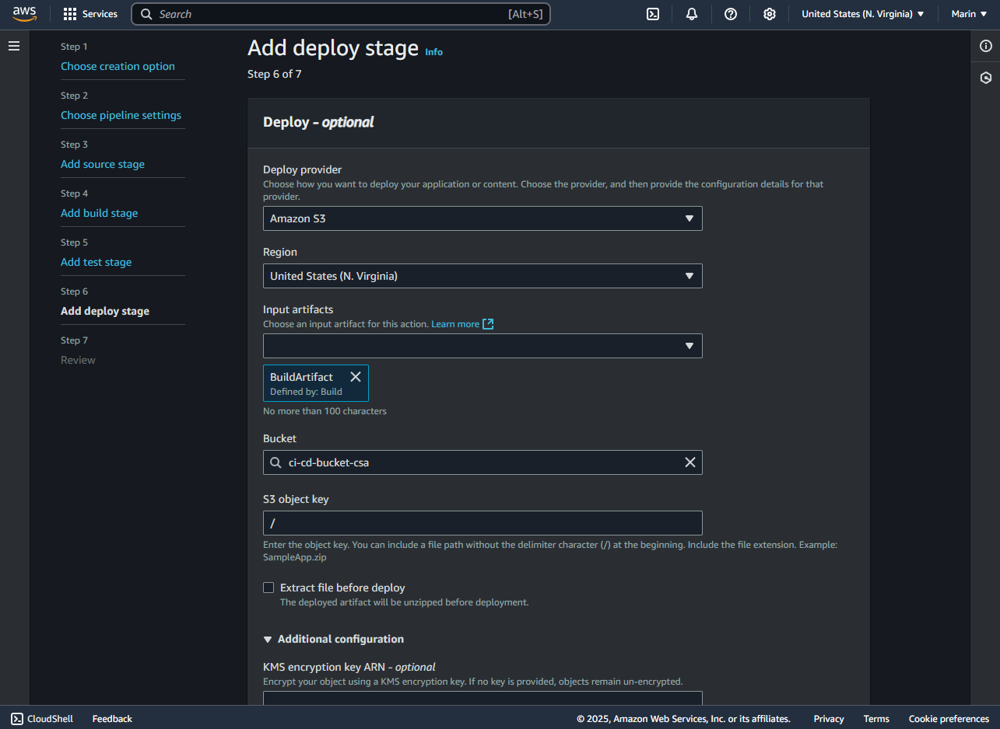

# CI/CD Pipeline with AWS Code Pipeline.

In this assigment I created a CI/CD Pipeline using AWS Code Pipeline.

# Requirements
An AWS Account

# Setup
For setting up this enviroment we are going to setup a repository in GitHub and a attach it to an AWS CodePipeline so it can grab the code from our repository and then deploying it to a S3 bucket (For this time due to this being a simple static HTML)

## Setup the repo
First we will be setting up a repo, in this case is this same exact repo, this contains a basic static HTML called `index.html`, this is what is going to be continously deployed on repo changes.

So setup a github repo and push some basic code to have as a base.


## Setup S3 Bucket
Now lets setup an S3 Bucket so we can store our 'built' code to be ready to deploy.

In this case because our app is a single static HTML what it will end up happening is that AWS Pipeline will take our HTML from Github and pass it to the S3 Bucket to deploy it.

So to do this in your AWS Dashbaord go to `S3` and click on `Create Bucket`

We will select a unique name.


Then scroll down to `Block Public Access Settings for this bucket` section and uncheck `Block All Public Access` and acknowledge the warning that the files might be public.


Then click `Create Bucket`

### Enable Static Web Hosting
Now that the bucket is setup, we will enable static web hosting so we can have access to our website once is deployed.

For this click on the bucket we just created in the S3 Dashboard and then go to `Properties` tab and scroll down to `Static website hosting` and click `Edit`

In this screen enable `Static Website hosting` and set the name of the `Index` document, in this case is `index.html`


For this basic setup these are all the settings required, scropp down an click `Save Changes`.

### Enable Public Access
Now we will be granting public access to our S3 bucket objects so the users can be able to reach the site.

For this, in the bucket settings go to `Permissions` tab and go to `Bucket Policy` and click `Edit`.

In Edit Bucket Policy screen we will be adding the next JSON Permission:

```JSON
{
  "Version": "2012-10-17",
  "Statement": [
    {
      "Sid": "PublicReadGetObject",
      "Effect": "Allow",
      "Principal": "*",
      "Action": "s3:GetObject",
      "Resource": "arn:aws:s3:::<S3NAME>/*"
    }
  ]
}
```
*Note: Change `<S3NAME>` with the name of your S3*

Now click on `Save Changes`


Now our S3 bucket is ready to host our HTML Webpage and users will be able to access to it.

## Setup AWS Code Pipeline
Now that everything around the pipeline is ready we will be setting it up all together.

Now navigate to your AWS Dashboard and search `Code Pipeline` and click on `Create Pipeline`

Here will be doing a series of steps to properly setup a pipeline that fit our needs.

In Choose Create Option screen, select `Build custom pipeline`


Then in Choose Pipeline Settings Page, select a `name` for the pipeline.

In execution mode select `Queued`.

And then let AWS to create a role automatically for this pipeline.


Now on Add Source Stage we will be setting a source provider, here select `GitHub via OAuth`

Go ahead and click `Connect to GitHub` and follow the steps to connect your account.

Once connected point at the repository we just created and select the branch if there are multiple of.

Then click `Next`


On the Adding Build Stage we will be selecting Other build providers and select AWS Code Build.

Then on project name we will be creating a new Project Build, this is going to open a new window that we needto setup.


### Create Build Project
On this screen we will be creating the Build Project, this we will be selecting a name.

On project type leave it on `Default Project`.


Then scroll down to the `Buildspec` section, here select `Use a buildspec file` and input the name `buildspec.yml`

This buildspec file tells Code Build what to do to 'build' our project, so for this case we only need to tell it to sync data to our S3 bucket from GitHub.

To do this we will be adding a buildspec.yml file into our root folder in our GitHub repo with the following code:

Make sure the filename is `buildspec.yml` or that it matches whatever name you selected
```YAML
version: 0.2

phases:
  build:
    commands:
      - aws s3 sync . s3://BUCKETNAME --delete

artifacts:
  files:
    - '**/*'
```

The buildspec section should look like this:


Continue to scroll down leaving everything on their default settings and click on `Continue to Code Pipeline`.

Now with the Build Project integrated we can coninue leaving everything in here on default.


Now we will be `skipping` the Test Stage because our simple static webpage has noting else to be tested, so go ahead and click `Skip Test Stage`


On the Add Deploy Stage screen we will setting up the deployment rules of our artifacts that were setup for creation in the 'build' stage, in this case basically is going to select our index.html and thats all.

Here we select `AmazonS3` as the deploy provider, make sure the region is in the same where your pipe line is.

In the Input Artifact section select `Build artifact`, this is telling that S3 is going to store whatever comes from build, and from build we specify that only our index.html is going through.

Then select a bucket based on the name.

And last select the `S3 Key` which is a file or folder where the project is going to be put, in this case just add `/` to deploy the files at the root of the bucket.

Then click `Next`


In the last step we just need to make sure all of the settings are correctly set, here you can also review what we have done and if anything need changes you can go back in the step process.

If everything is OK, click on `Create Pipeline`


Once finished the pipeline should start working automatically on the deployment on what is currently available in the Git Hub Repository.


Now, this first build might fail because we set it up in a way that in the 'Build' phase it will automatically replace the files from the GitHub repo to our S3 bucket, so now we need to add the permissions to that role.

## Setup Permissions for Pipeline
Now we will be granting access to our S3 Bucket to our Pipeline to write and delete files, to do this go to `IAM` in the AWS Dashboard.

Then go to `Roles` and look for the automatic role generated for the pipeline, it should be called something like `AWSCodePipelineServiceRole-region-name`, then click on it.

Once in is settings go to to the 